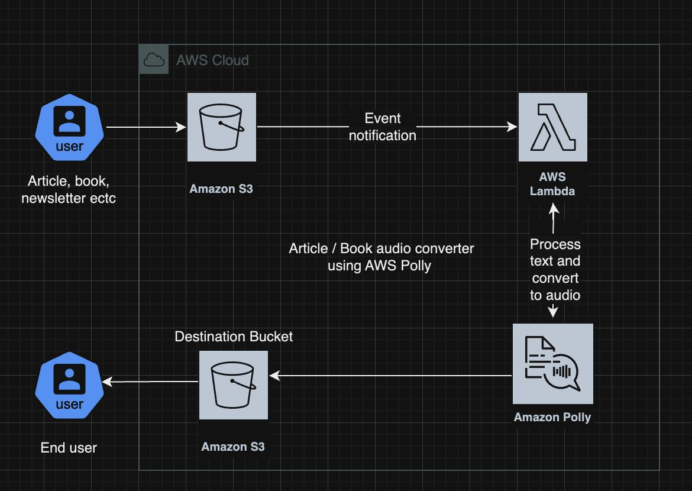

# Polly-Proyect-AWS

##  The goal of this project is to be able to use the AWS Polly service to convert text to audio with realistic human voices, using artificial intelligence and advanced speech synthesis techniques.

## Project Architecture, Steps to Build the Project:

-   Step 1: Set Up an AWS Account
    
-   Step 2: Create two S3 Buckets (Source S3 Bucket Name: polly-source-bucket, Destination S3 Bucket Name: polly-end-destination-bucket)
    
-   Step 3: Create an IAM Policy (IAM Policy Name: polly-lambda-policy)  
    Policy Defination:
>
> {
  "Version": "2012-10-17",
  "Statement": [
      {
          "Effect": "Allow",
          "Action": [
              "s3:GetObject",
              "s3:PutObject"
          ],
          "Resource": [
              "arn:aws:s3::: polly-source-bucket/*",
              "arn:aws:s3::: polly-end-destination-bucket/*"
          ]
      },
      {
          "Effect": "Allow",
          "Action": [
              "polly:SynthesizeSpeech"
          ],
          "Resource": "*"
      }
  ]
}
>

-   Step 4: Create an IAM Role (IAM Role Name: polly-lambda-role) and attach amc-polly-lambda-policy and AWSLambdaBasicExecutionRole Policies
    
-   Step 5: Create and Configure the Lambda Function (Lambda Function Name: TextToSpeechFunction)
    -   Set the runtime to Python 3.8.
    -   Set the execution role with necessary permissions for S3 and Polly. (Step 4)
    -   Add Environment Variables (`SOURCE_BUCKET`: Name of your source S3 bucket and  `DESTINATION_BUCKET`: Name of your destination S3 bucket.
-   Step 6: Configure S3 Event Notification
    
    -   Set up an event notification in the source S3 bucket to trigger the Lambda function on new object creation events with the  `.txt`  suffix.
-   Step 7: Write Lambda Function Code
    
-   Step 8: Test the System